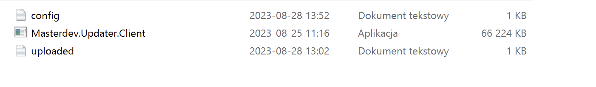

# RestAPI for appfileupdates
 Server holding update files

Rest Api with api key authoriization, storing files, versions, validating versions and returning files with update.

 

Using my next solution Console-app-for-updating-applications u fetch to this api and get update zip if it is uploaded u need a db to store it I used Mysql so if u use Mysql u just need to change Connection Sstring in other options u need to change builder options for your db.

## Create these 2 files inside RestAPI directory
 

## Create ClientApp in ClientFiles is ziped when creating new app
 

## In ClientApp 
 

## Updatezips folder stores all update zips uploaded
